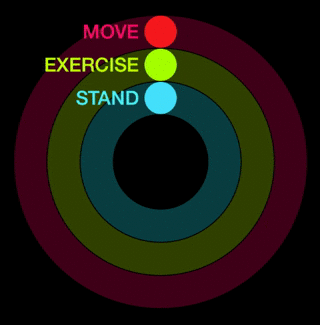
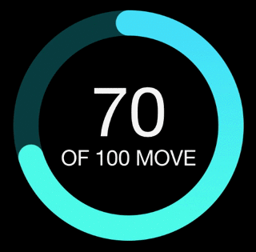
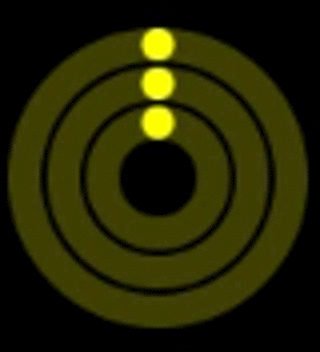

#Ring Graph

Ring Graph is an imitation of ring graph seen on Apple Watch. There is still some work required to make it more like the Apple version, but can already be used as provided.

##Usage

There are three "modes" the graph can be presented in.

###Triple mode



```swift
let tripleGraphMeters = [RingMeter(title: "Move", value: 100, maxValue: 100, colors: [AppleBlue1, AppleBlue2], symbolProvider: RightArrowPathProvider()),
            RingMeter(title: "Exercise", value: 72, maxValue: 100, colors: [AppleGreen1, AppleGreen2], symbolProvider: DoubleRightArrowPathProvider()),
            RingMeter(title: "Stand", value: 45, maxValue: 100, colors: [AppleRed1, AppleRed2], symbolProvider: UpArrowPathProvider())]
            
if let graph = RingGraph(meters: tripleGraphMeters) {
	let ringGraphView = RingGraphView(frame: frame, graph: graph, preset: .MetersDescription)
}
```

###Single mode



```swift
let singleGraphMeter = [RingMeter(title: "Move", value: 70, maxValue: 100, colors: [AppleRed1, AppleRed2])]

if let graph = RingGraph(meters: singleGraphMeter) {
	let ringGraphView = RingGraphView(frame: frame, graph: graph, preset: .CentralDescription)
}
```

###Mini mode



```swift
let color = UIColor.yellowColor()
        let singleColorGraphMeters = [RingMeter(title: "Move", value: 68, maxValue: 100, colors: [color]),
            RingMeter(title: "Exercise", value: 63, maxValue: 100, colors: [color]),
            RingMeter(title: "Stand", value: 40, maxValue: 100, colors: [color])]

if let graph = RingGraph(meters: singleColorGraphMeters) {
	let ringGraphView = RingGraphView(frame: frame, graph: graph, preset: .None)
}
```
##Current impediments you should consider
Aside from all visual improvements that are still needed there are two major functional differences that still need to be fixed.
* Ring can onbly present max value of 100%. This means it can not go over 360 degrees.
* Graph can only be animated from 0 to end value. So it is currently impossible to present graph at 50% value and animate it to i.e. 75%.

##License
RingGraph is published under the MIT license.
